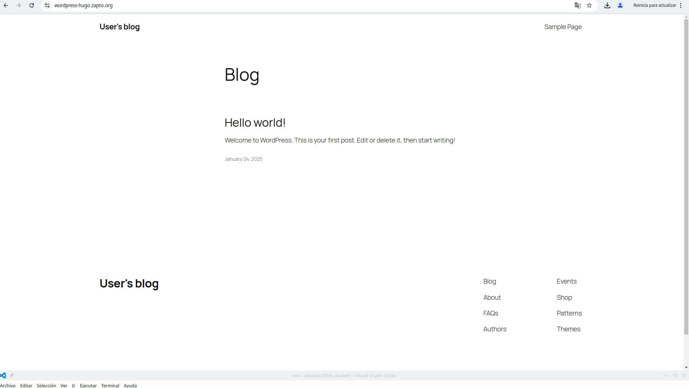

# Práctica 5.2: Desplegando WordPress con Docker

## Instalación de Docker y Docker Compose
Primero que nada tenemos que actualizar los paquetes disponibles e instalar Docker y Docker Compose en nuestro sistema.
```bash
sudo apt update
sudo apt install docker.io docker-compose -y
```
## Configuración de permisos para Docker
Para poder ejecutar comandos de Docker sin necesidad de permisos de sudo, añadimos nuestro usuario al grupo docker con el siguiente comando:
```bash
sudo usermod -aG docker ubuntu
```
Después aplicamos los cambios con este comando.
```bash
newgrpdocker
```

## Configuración de las variables de entorno
Creamos un archivo llamado .env el cual va a tener las credenciales necesarias.

### Variables de entorno de MySQL
```bash
MYSQL_DATABASE=wordpress_db # Nombre de la base de datos que usará WordPress.
MYSQL_USER=wordpress_user # Usuario que tendrá acceso a la base de datos.
MYSQL_PASSWORD=secure_password # Contraseña del usuario de la base de datos.
MYSQL_ROOT_PASSWORD=root_password # Contraseña del usuario root de MySQL.
```

### Variables de entorno de WordPress
```bash
WORDPRESS_ADMIN_USER=admin # Usuario administrador de WordPress.
WORDPRESS_ADMIN_PASSWORD=admin_password # Contraseña del usuario administrador.
WORDPRESS_ADMIN_EMAIL=admin@example.com # Correo electrónico del administrador.
WORDPRESS_DB_HOST=mysql # Nombre del servicio de la base de datos en el entorno de Docker
```

### Configuración del dominio y Let's Encrypt
```bash
DOMAIN=wordpress-hugo.zapto.org # Dominio en el cual se desplegará WordPress.
LETSENCRYPT_STAGE=production  # Modo de operación de Let's Encrypt
```
### Desplegando WordPress con Docker Compose
Una vez configuradas las variables de entorno,lanzamos nuestro [contenedor](./docker-compose.yml).
```bash
docker-compose up -d
```
Esto levantará los servicios en segundo plano. Si todo está configurado correctamente, podremos acceder a WordPress a través del dominio especificado (wordpress-hugo.zapto.org).

Si todo funciona correctamente, la instalación de WordPress debería verse similar a la siguiente imagen:
